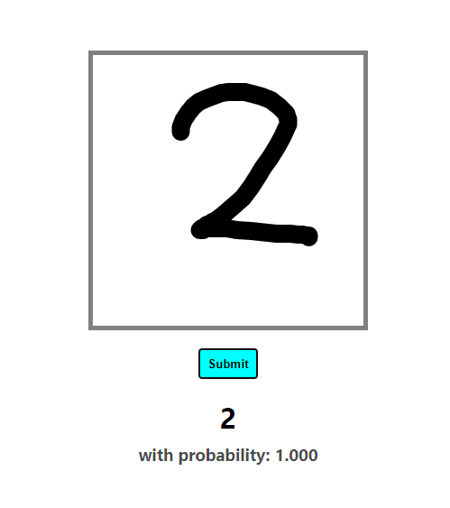

# Django-React-Digit-Recognizer

A CNN based digit recognizer which takes input as canvas drawing using React and process it on server-side using Django Rest-Framework

A snapshot of app:

### `npm start`

Runs the app in the development mode.\
Open [http://localhost:3000](http://localhost:3000) to view it in the browser.

### `npm run build`

Builds the app for production to the `build` folder.\

## Using

- Clone the repo and go to the directory

- run `python manage.py runserver` to run the django server.

- run `npm install && npm run build` to install the required packges and build the project and thats it. open the link shown in terminal and play with the AI.
